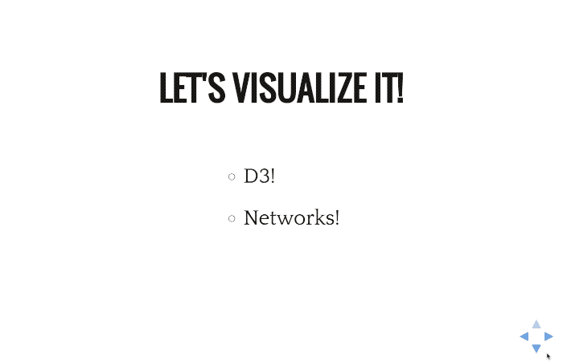

# RevealVizScroll

A Reveal.js plugin for faking visualization scrollyteling. It lets you create incremental visualizations that stay on the screen between slides, like this one


http://johnguerra.co/slides/untanglingTheHairball

## Usage

1) Create your typical reveal.js presentation, then include revealVizScroll.css and d3.v4.js
```html
<html>
  <head>
    <link rel="stylesheet" href="css/reveal.css">
    <link rel="stylesheet" href="css/theme/white.css">
    <link rel="stylesheet" href="css/revealVizScroll.css">
    <!-- Other headers -->
  </head>
  <body>
    <!-- reveal sections -->

    <script src="js/head.min.js"></script>
    <script src="js/reveal.js"></script>
    <script src="js/d3.v4.min.js"></script>

    <!-- reveal initialize and other scripts -->
  </body>
</html>
```
2) Add the library revealVizScroll.js to Reveal.js dependencies, with a callback that creates your scrollables
```html
    <script>
      function moveLeft(ele) {
        d3.select(ele)
          .select("circle")
          .transition()
          .duration(1000)
            .attr("cx", 100);
      }

      function moveRight(ele) {
        d3.select(ele)
          .select("circle")
          .transition()
          .duration(1000)
            .attr("cx", 300);
      }

      function doStep(step) {
        if (step==="step 0") moveLeft(this);
        else if (step==="step 1") moveRight(this);
      }

    </script>
    <script>
      Reveal.initialize({
        dependencies: [
          { src : "js/revealVizScroll.js",
            async: false,
            callback: function () {
              revealVizScroll.makeScrollable("demo", doStep);
            }
          }
        ],

      });
    </script>
```

3) Add the *scroll* class to the sections you want to scroll, with two additional attributes *scrollable* with an id of the viz, and step with the id of the step.

```html
    <div class="reveal">
      <div class="slides">
        <section>
          <section>
            <h1>No scrolling slide</h1>
          </section>
          <section class="scroll" scrollable="demo" step="step 0" >
            <h2>Scrolling slide step 0</h2>
          </section>
          <section class="scroll" scrollable="demo" step="step 1" >
            <h2>Scrolling slide step 0</h2>
          </section>
        </section>
      </div>
    </div>
```

4) **Optional** If you want add a base code for your visualization as a div with the classes scrollable and scrollable-nameYourViz, where nameYourViz matches the parameter value of scrollable in your sections (e.g. scrollable-demo). If you don't add the placeholder, we'll add it for you, that's how much we like you!

```html
  <div class="reveal">
    <div class="slides">
      <div class="scrollable scrollable-demo">
        <svg width=400 height=400>
          <circle cx=200 cy=200 r=20 style="fill:steelblue"></circle>
        </svg>
      </div>

      <!-- Your slides -->
    </div>
  </div>
```

### Basic Example

```html
<html>
  <head>
    <link rel="stylesheet" href="css/reveal.css">
    <link rel="stylesheet" href="css/theme/white.css">
    <link rel="stylesheet" href="css/revealVizScroll.css">
    <meta name="viewport" content="width=device-width, initial-scale=1.0, maximum-scale=1.0, user-scalable=no, minimal-ui">
  </head>
  <body>
    <div class="reveal">
      <div class="slides">
        <!-- Optional: Placeholder for your scrollable viz -->
        <div class="scrollable scrollable-demo">
          <svg width=400 height=400>
            <circle cx=200 cy=200 r=20 style="fill:steelblue"></circle>
          </svg>
        </div>

        <!-- Your slides -->
        <section>
          <section>
            <h1>No Scrolling</h1>
          </section>
          <section class="scroll" scrollable="demo" step="step 0" >
            <h2>Step 0 text</h2>
          </section>
          <section class="scroll" scrollable="demo" step="step 1" >
            <h2>Step 1 text</h2>
          </section>
          <section>
            <h2>No scrolling again</h2>
          </section>
        </section>
      </div>
    </div>
    <script src="js/head.min.js"></script>
    <script src="js/reveal.js"></script>
    <script src="js/d3.v4.min.js"></script>
    <script>
      function moveLeft(ele) {
        d3.select(ele)
          .select("circle")
          .transition()
          .duration(1000)
            .attr("cx", 100);
      }

      function moveRight(ele) {
        d3.select(ele)
          .select("circle")
          .transition()
          .duration(1000)
            .attr("cx", 300);
      }

      function doStep(step) {
        if (step==="step 0") moveLeft(this);
        else if (step==="step 1") moveRight(this);
      }

    </script>
    <script>
      Reveal.initialize({
        dependencies: [
          { src : "js/revealVizScroll.js",
            async: false,
            callback: function () {
              revealVizScroll.makeScrollable("demo", doStep);
            }
          }
        ],

      });
    </script>
  </body>
</html>
```

